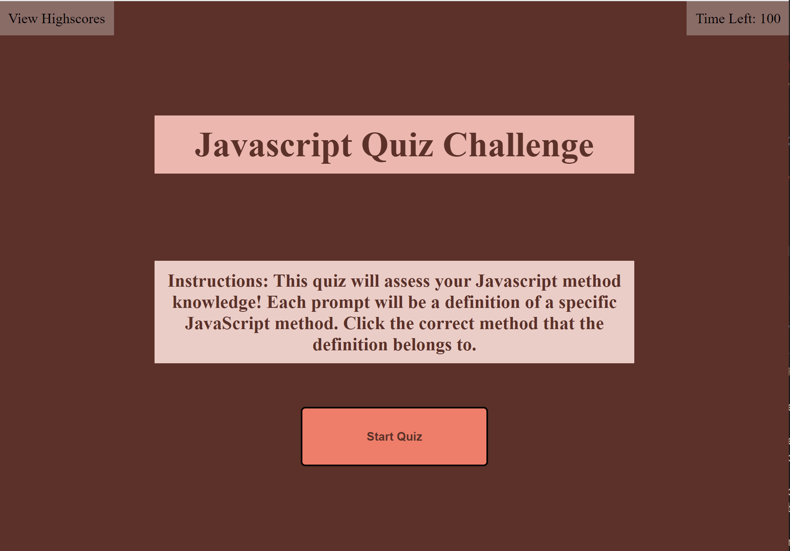
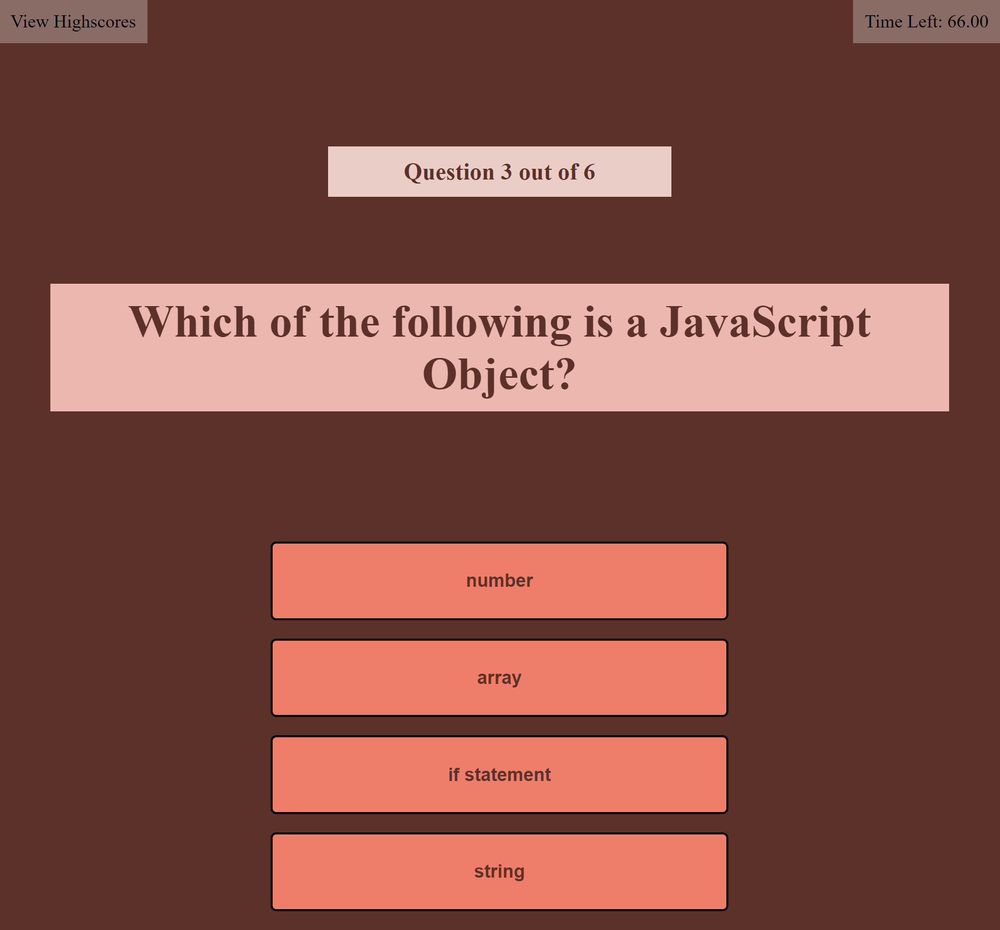
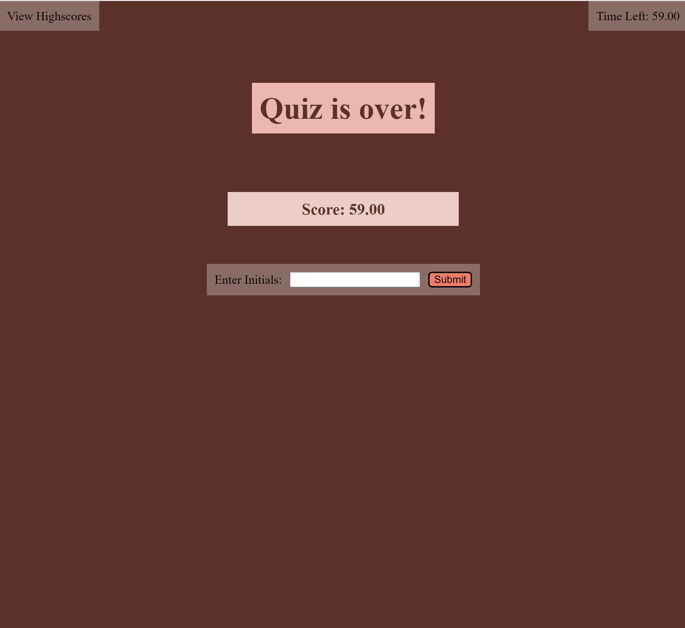
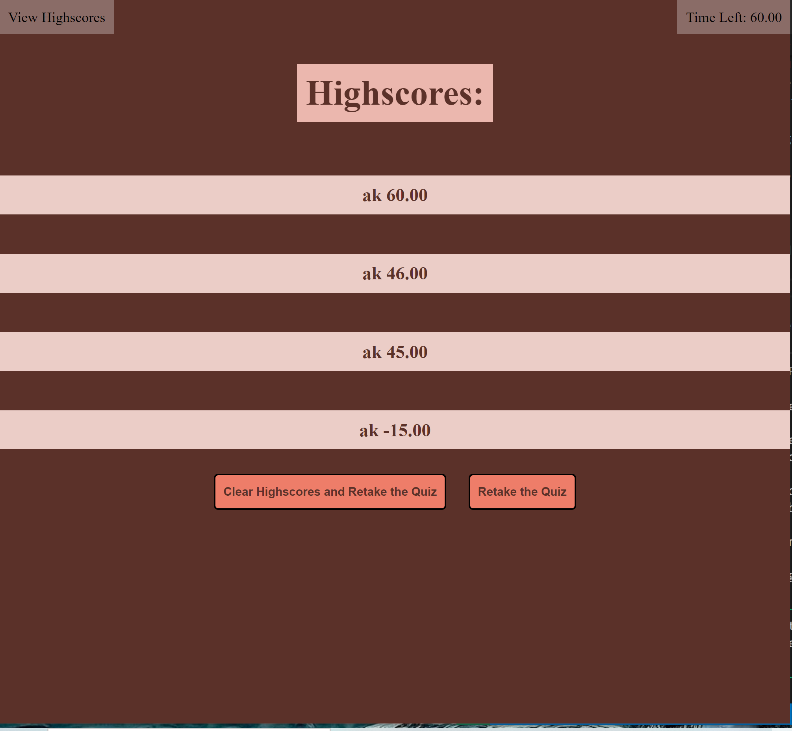

# ak02-challenge

## Description
This repository was made with a goal to utilize Javascript skills to create a website that consists of a coding quic with a timer and highscore sheet which inputs can be aded and stored to local storage. This code utilized a timer, text input fields and functionals buttons that allow the user to take an effective quiz and allows the user to store scores in each session in a highscores page that lists the user input and score total by order of highest score.

This quiz can be adjusted and have questions added to the question array and either lengthen the quiz or use the random question selector to select a particular number of questions from the array.

## Usage

https://keberlea.github.io/akcodingquiz/

 

## Credits

University of Oregon- EDex bootcamp

## License
